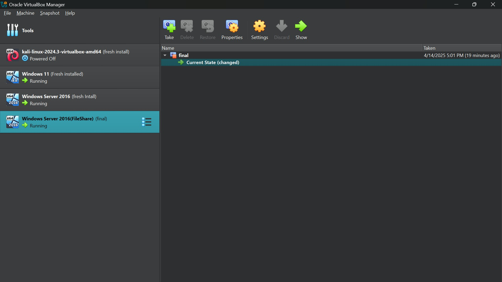
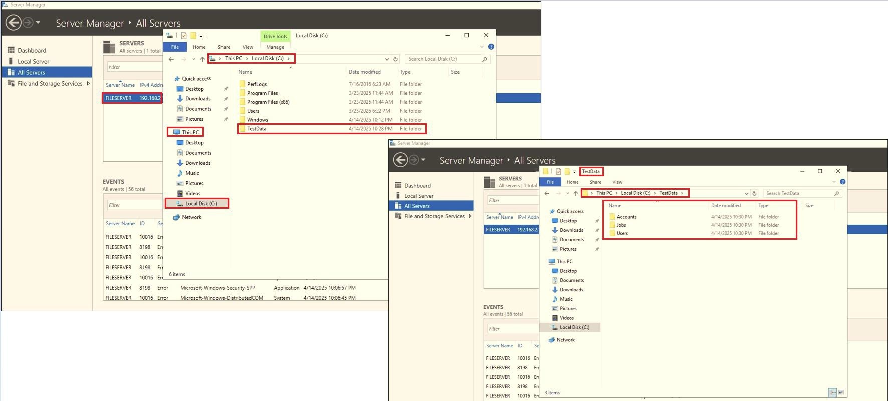

# Active Directory Lab 

## 📋 Overview  

This project involved setting up and securing a small Active Directory (AD) environment to better understand Windows domain management and system hardening techniques. The virtual environment consisted of a Domain Controller (DC), a File Server, and a Client machine.

---

## ⚙️ Lab Setup  

### 🖥️ Virtual Machines  

- **Domain Controller (DC):** Windows Server 2016

- **File Server:** Windows Server 2016 (FileShare)

- **Client Machine:** Windows 11

- **Domain Name:** 505Group3.local
  

---

### 🧱 Active Directory Configuration  

- **Groups Created:**

  - Test1

  - Test2

  

  

- **Users Created:**

  - April → added to Test1

  - May → added to Test1

  - June → added to Test2

  - July → added to Test2

  - August → not added to any group
  

  

  

* **Organizational Units:** Default

---

### 📠File Server Setup  

- **Role Installed:** File Server

- **Shared Folder:** C:\TestData

   - **Subfolders:** Users, Jobs, Accounts

  

---

### 🔠Permissions Configuration  

- All users → full access to TestData\Users

- Test1 group → modify access to Jobs

- Test2 group → read/write access to Accounts

- August → read-only access to Jobs

---

### 🧪 RBAC Testing  

- Logged in with each user account from the client machine

- Verified folder access based on group membership

- Modified group membership dynamically and tested RBAC limitations

---

### 🔠Security Evaluation Tools  

The following tools were explored for auditing and evaluation:

- **Ping Castle** – Domain security health check

- **BloodHound** – AD privilege escalation mapping

- **CIS Benchmarks** – Security compliance checklists

- **Nessus** – Vulnerability scanning

- **Windows Security Baseline** – Group Policy reference

---

### 🛡️ Hardening Steps  

- Created a separate local admin account

- Enabled BitLocker with Enhanced PIN on DC

- Enabled Windows Defender with real-time protection

- Disabled SMBv1 across all machines

- Applied Group Policies for:

  - Password complexity, lockout policy

  - Auto screen lock after inactivity

  - UAC and firewall settings

- Configured host-based firewalls

- Disabled unused services and ports

---

### 🧾 Challenges & Lessons Learned  

**🔧 Challenges Faced**

- Group Policy settings not applying due to replication delays

- Initial RBAC misconfigurations causing access denials

- Tool compatibility issues with older OS versions

**📠Lessons Learned  **

- Practical understanding of AD structure and user/group management

- How to enforce least privilege access with RBAC

- Real-world implementation of security baselines

- Importance of continuous auditing and evaluation in domain environments

---

### 📌 Conclusion

This lab provided hands-on experience in managing and securing a Windows Active Directory environment. Through iterative testing, research, and implementation, I developed critical skills in systems administration, RBAC enforcement, and domain hardening. The project was instrumental in understanding the foundational concepts of virtualization and system security.

[← Back](https://github.com/mmransem09/mmransem09/blob/main/README.md)
